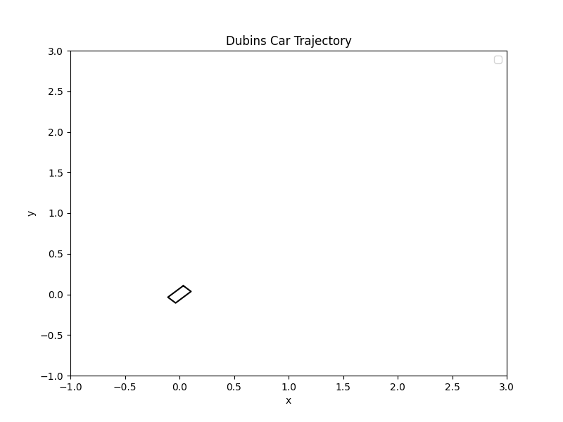

# Constrained Differential Dynamic Programming (CDDP) solver in C++
```<span style="color:lightblue">
+---------------------------------------------------------+
|    ____ ____  ____  ____    _          ____             |
|   / ___|  _ \|  _ \|  _ \  (_)_ __    / ___| _     _    |
|  | |   | | | | | | | |_) | | | '_ \  | |   _| |_ _| |_  |
|  | |___| |_| | |_| |  __/  | | | | | | |__|_   _|_   _| |
|   \____|____/|____/|_|     |_|_| |_|  \____||_|   |_|   |
+---------------------------------------------------------+
```

**This library is actively under construction.** Please wait for proper release after starring this repo :star:
Also, I am writing this library for practical experience with C++. Any suggestions are helpful to me.

## Overview
This is an optimal control solver library using constrained differential dynamic programming (CDDP) written in C++ based on Xie's [paper](https://zhaomingxie.github.io/projects/CDDP/CDDP.pdf). This library is particularly useful for mobile robot trajectory optimization and model predictive control (MPC).

The CDDP library solves problems in the form:

$$
\min_{\mathbf{U}} J(\mathbf{x}_0, \mathbf{U}) = \phi(\mathbf{x}_N) + \sum \ell(\mathbf{x}_k,\mathbf{u}_k)
$$

$$
\mathrm{s.t.~}  \mathbf{x}_{k+1} = \mathbf{f}(\mathbf{x}_k,\mathbf{u}_k) 
$$

$$
\quad \mathbf{g}(\mathbf{x}_k,\mathbf{u})_k\leq 0
$$

$$
\quad {\mathbf{x}}_{0} = \mathbf{x}{(t_0)} 
$$

$$
\quad k = 0,1,\cdots N-1
$$

**Author: Tomohiro Sasaki** 

## Examples
### Dubins Car

Simple car-like robot with velocity and steering control:

```bash
./examples/cddp_dubins_car // after building
```



### Bicycle Model

Bicycle model with velocity and steering control:

```bash
./examples/cddp_bicycle // after building
```


### Pendulum

Simple pendulum with torque control:

```bash
./examples/cddp_pendulum // after building
```


### Cartpole

Cartpole with cart control:

```bash
./examples/cddp_cartpole // after building
```


### Quadrotor

Quadrotor with thrust control:

```bash
./examples/cddp_quadrotor // after building
```


### Manipulator

Manipulator with joint torque control:

```bash
./examples/cddp_manipulator // after building
```


## Installation
### Dependencies
* [Eigen](https://formulae.brew.sh/formula/eigen) (Linear Algebra Library in CPP)
    
```bash
sudo apt-get install libeigen3-dev # For Ubuntu
brew install eigen # For macOS
```

Although the library automatically finds and installs the following dependencies via [FetchContent](https://cmake.org/cmake/help/latest/module/FetchContent.html), if you do not have ones, here is how you can install on your own.

* [OSQP](https://osqp.org/) (QP solver) and [osqp-cpp](https://github.com/google/osqp-cpp) (C++ Wrapper for OSQP)
```bash
conda install -c conda-forge osqp # Optional
```

### Building
```bash
git clone https://github.com/astomodynamics/cddp-cpp
cd cddp-cpp
mkdir build && cd build
cmake ..
make -j4
make test
```

## Basic Usage


## ROS 
If you want to use this library for ROS2 MPC node, please refer [CDDP MPC Package](https://github.com/astomodynamics/cddp_mpc_pkg)

## References
* Zhaoming Xie, C. Karen Liu, and Kris Hauser, "Differential Dynamic Programming with Nonlinear Constraints," 2017 IEEE International Conference on Robotics and Automation (ICRA), 2017.
* Zhamming Xie's GitHub repository: <https://github.com/ZhaomingXie/CDDP>
* ZJU FAST Lab's GitHub repository: <https://github.com/ZJU-FAST-Lab/SDQP>
* Yuval Tassa's iLQG/DDP trajectory optimization: <https://www.mathworks.com/matlabcentral/fileexchange/52069-ilqg-ddp-trajectory-optimization>

## Citing
If you use this work in an academic context, please cite this repository.

## License
This project is licensed under the Apache License 2.0 - see the [LICENSE](LICENSE) file for details.

## TODO
* add state constraint handling
* add initial guess functionality based on path planner solution
* add automatic differentiation
* add nonlinear objective and constraint handling
* add parallelization
* add simulation and its plots
  * Quadrotor
  * Quadruped robot
  * Manipulator
  * Spacecraft
  * Humanoid
