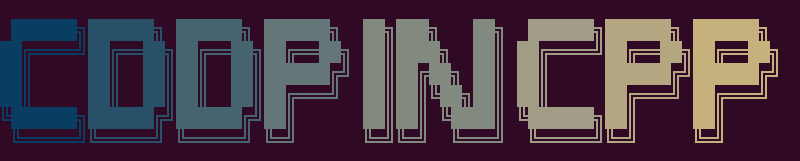
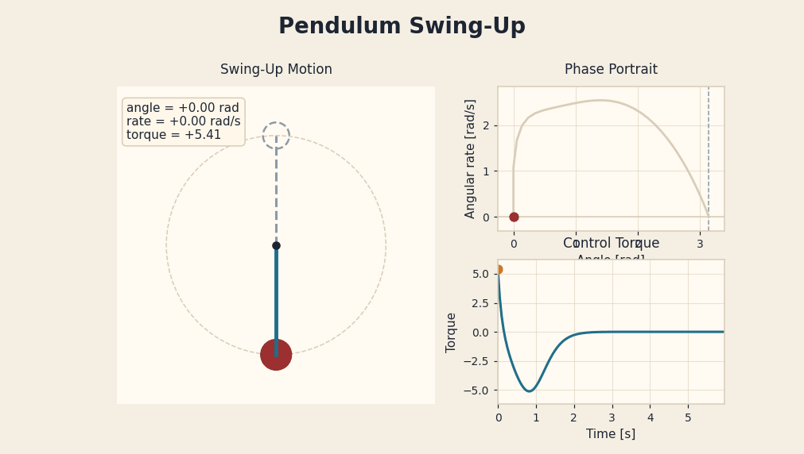
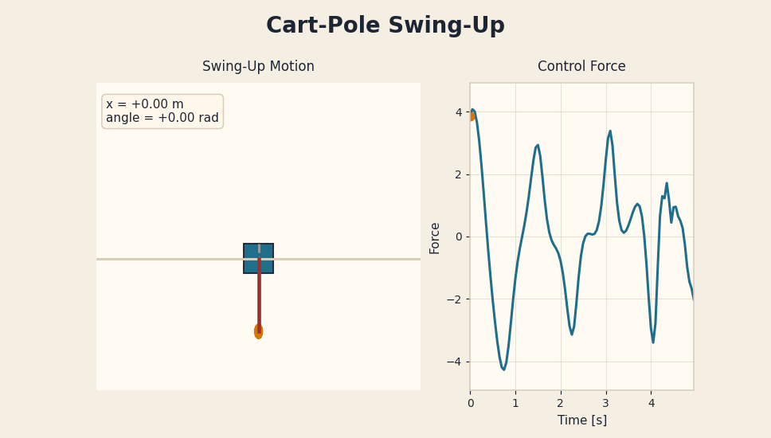
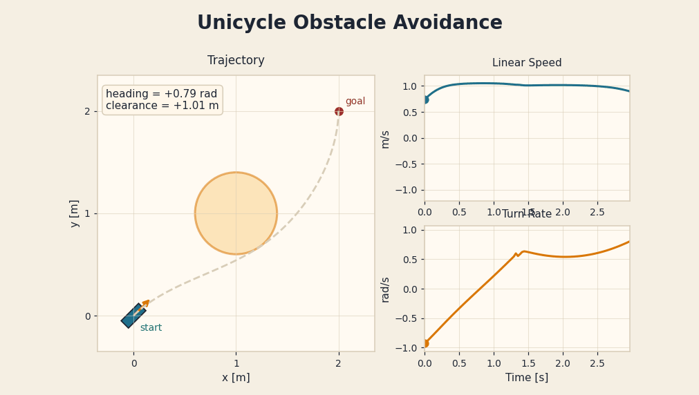
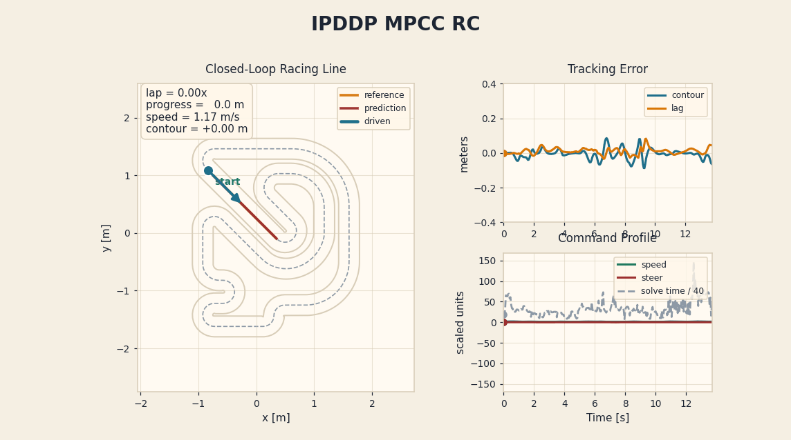

# Constrained Differential Dynamic Programming (CDDP) solver in C++


This repository contains a C++ implementation of constrained differential dynamic programming (CDDP) and related solvers for trajectory optimization and model predictive control.

## Overview
This is an optimal control solver library using constrained differential dynamic programming (CDDP) written in C++. This library is particularly useful for mobile robot trajectory optimization and model predictive control (MPC).

The CDDP library solves problems in the form:

$$
\min_{\mathbf{U}} J(\mathbf{x}_0, \mathbf{U}) = \phi(\mathbf{x}_N) + \sum \ell(\mathbf{x}_k,\mathbf{u}_k)
$$

$$
\mathrm{s.t.~}  \mathbf{x}_{k+1} = \mathbf{f}(\mathbf{x}_k,\mathbf{u}_k) 
$$

$$
\quad \mathbf{g}(\mathbf{x}_k,\mathbf{u})_k\leq 0
$$

$$
\quad {\mathbf{x}}_{0} = \mathbf{x}{(t_0)} 
$$

$$
\quad k = 0,1,\cdots N-1
$$

## Examples
The maintained example surface is now split:

* a small C++ reference set in `examples/`, built when `CDDP_CPP_BUILD_EXAMPLES=ON`
* the Python portfolio for plotting, animation, and notebook workflows

The kept C++ examples are:

* `cddp_pendulum.cpp`
* `cddp_cartpole.cpp`
* `cddp_unicycle.cpp`
* `cddp_quadrotor_point.cpp`
* `cddp_manipulator.cpp`

The wider historical C++ example inventory has been removed to keep the example
surface focused. The kept C++ examples are intentionally minimal and do not depend on
visualization libraries.

### Python Portfolio
The Python bindings now ship with a small animation-focused portfolio built on
top of the same solver models used by the C++ examples:

```bash
source .venv/bin/activate
python examples/python_portfolio.py --demo all
```

This generates GIFs under `docs/assets/python_portfolio/` for:

* pendulum swing-up
* cart-pole swing-up
* unicycle obstacle avoidance
* full-lap MPCC racing line tracking

See [docs/python_portfolio.md](docs/python_portfolio.md) for the gallery and
regeneration command.

Pendulum swing-up:


Cart-pole swing-up:


Unicycle obstacle avoidance:


MPCC racing line tracking:


The MPCC portfolio example is a lightweight kinematic contouring-control demo.
Its vendored track data in `examples/data/` is derived from the
[`alexliniger/MPCC`](https://github.com/alexliniger/MPCC) project.

## Installation
### Dependencies
* [CMake](https://cmake.org/) (Build System)
```bash
sudo apt-get install cmake # For Ubuntu
brew install cmake # For macOS
```

* [Eigen](https://formulae.brew.sh/formula/eigen) (Linear Algebra Library in CPP)
```bash
sudo apt-get install libeigen3-dev # For Ubuntu
brew install eigen # For macOS
```

### Python package
Tagged releases publish the Python bindings to PyPI:

```bash
pip install pycddp
```

Prebuilt wheels are intended for CPython 3.10-3.13 on Linux, macOS, and
Windows. If a wheel is not available for your platform yet, install from
source using the steps below.

### Building from source
```bash
git clone https://github.com/astomodynamics/cddp-cpp
cd cddp-cpp
mkdir build && cd build
cmake ..
make -j4
make test
```

### Documentation
The project site is published through GitHub Pages at:

<https://astomodynamics.github.io/cddp-cpp/>

The Pages workflow builds the Markdown docs from `docs/` using MkDocs.

## ROS 
If you want to use this library for ROS2 MPC node, please refer [CDDP MPC Package](https://github.com/astomodynamics/cddp_mpc). You do not need to install this library to use the package. MPC package will automatically install this library as a dependency.

## References
* Y. Tassa, N. Mansard and E. Todorov, "Control-limited differential dynamic programming," 2014 IEEE International Conference on Robotics and Automation (ICRA), 2014, pp. 1168-1175, doi: <10.1109/ICRA.2014.6907001>.
* Pavlov, A., Shames, I., and Manzie, C., “Interior Point Differential Dynamic Programming,” IEEE Transactions on Control Systems Technology, Vol. 29, No. 6, 2021, pp. 2720–2727.
* Liniger, A., Domahidi, A., and Morari, M., “Optimization-based autonomous racing of 1:43 scale RC cars,” Optimal Control Applications and Methods, 2015. doi: <10.1002/oca.2123>.

## Third Party Libraries

This library uses the following open-source libraries as core dependencies:

* [autodiff](https://github.com/autodiff/autodiff) (MIT License)

This library also uses the following open-source libraries for optional features:

* [Ipopt](https://github.com/coin-or/Ipopt) (EPL License)
* [CasADi](https://web.casadi.org/) (GPL License)


## Citing
If you use this work in an academic context, please cite this repository.

## License
This project is licensed under the Apache License 2.0 - see the [LICENSE](LICENSE) file for details.

## Collaboration
Contributions are welcome.

Start with:

- [CONTRIBUTING.md](CONTRIBUTING.md) for setup, validation, and PR expectations
- [CODE_OF_CONDUCT.md](CODE_OF_CONDUCT.md) for community standards
- [SECURITY.md](SECURITY.md) for vulnerability reporting guidance

Use GitHub issues for bug reports and feature requests, and open pull requests against `master`.

## TODO
* improve python binding ergonomics
* improve parallelization
* add simulation examples and Python visualizations
  * Quadruped robot
  * Manipulator
  * Humanoid
