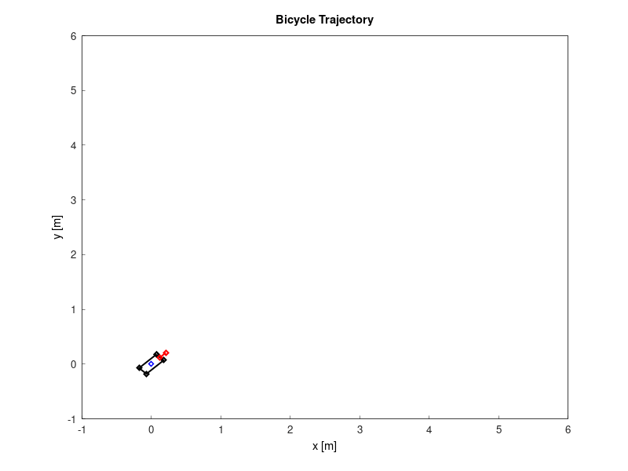

# Constrained Differential Dynamic Programming (CDDP) solver in C++
```<span style="color:lightblue">
+---------------------------------------------------------+
|    ____ ____  ____  ____    _          ____             |
|   / ___|  _ \|  _ \|  _ \  (_)_ __    / ___| _     _    |
|  | |   | | | | | | | |_) | | | '_ \  | |   _| |_ _| |_  |
|  | |___| |_| | |_| |  __/  | | | | | | |__|_   _|_   _| |
|   \____|____/|____/|_|     |_|_| |_|  \____||_|   |_|   |
+---------------------------------------------------------+
```

**This library is under active development.**  Star the repo :star: to stay updated on its progress and eventual release. I welcome any suggestions as I'm building this library to gain practical C++ experience.

## Overview
This is an optimal control solver library using constrained differential dynamic programming (CDDP) written in C++. This library is particularly useful for mobile robot trajectory optimization and model predictive control (MPC).

The CDDP library solves problems in the form:

$$
\min_{\mathbf{U}} J(\mathbf{x}_0, \mathbf{U}) = \phi(\mathbf{x}_N) + \sum \ell(\mathbf{x}_k,\mathbf{u}_k)
$$

$$
\mathrm{s.t.~}  \mathbf{x}_{k+1} = \mathbf{f}(\mathbf{x}_k,\mathbf{u}_k) 
$$

$$
\quad \mathbf{g}(\mathbf{x}_k,\mathbf{u})_k\leq 0
$$

$$
\quad {\mathbf{x}}_{0} = \mathbf{x}{(t_0)} 
$$

$$
\quad k = 0,1,\cdots N-1
$$

## Examples
### Unicycle

Simple car-like robot with velocity and steering control:

```bash
./examples/cddp_unicycle // after building
```


### Unicycle with Obstacle Avoidance

Simple car-like robot with velocity and steering control:

```bash
./examples/cddp_unicycle_safe // after building
```


### Unicycle with Obstacle Avoidance (infeasible initial guess)

```bash
./examples/cddp_unicycle_safe_ipddp // after building
```


### Bicycle Model

Bicycle model with velocity and steering control:

```bash
./examples/cddp_bicycle // after building
```



### Control-limited Car

Car model with limited velocity and steering control:

```bash
./examples/cddp_car // after building
```


### Pendulum

Simple pendulum with torque control:

```bash
./examples/cddp_pendulum // after building
```


### Cartpole

Cartpole with cart control:

```bash
./examples/cddp_cartpole // after building
```


### Quadrotor

Quadrotor with thrust control:

```bash
./examples/cddp_quadrotor // after building
```


### Manipulator

Manipulator with joint torque control:

```bash
./examples/cddp_manipulator // after building
```


## Installation
### Dependencies
* [Eigen](https://formulae.brew.sh/formula/eigen) (Linear Algebra Library in CPP)
    
```bash
sudo apt-get install libeigen3-dev # For Ubuntu
brew install eigen # For macOS
```
Although the library automatically finds and installs the following dependencies via [FetchContent](https://cmake.org/cmake/help/latest/module/FetchContent.html), if you do not have ones, here is how you can install on your own.

* [OSQP](https://osqp.org/) (QP solver) and [osqp-cpp](https://github.com/google/osqp-cpp) (C++ Wrapper for OSQP)
```bash
conda install -c conda-forge osqp # Optional
```
* [libtorch](https://pytorch.org/get-started/locally/) : This library utilizes Torch for its underlying computations. It will be automatically installed during the build process.

* [CUDA](https://developer.nvidia.com/cuda-toolkit)(Optional): If you want to leverage GPU acceleration for torch, ensure you have CUDA installed. You can download it from the [NVIDIA website](https://developer.nvidia.com/cuda-12-4-0-download-archive?target_os=Linux&target_arch=x86_64&Distribution=Ubuntu&target_version=22.04&target_type=deb_local).

### Building
```bash
git clone https://github.com/astomodynamics/cddp-cpp
cd cddp-cpp
mkdir build && cd build
cmake ..
make -j4
make test
```

## ROS 
If you want to use this library for ROS2 MPC node, please refer [CDDP MPC Package](https://github.com/astomodynamics/cddp_mpc). You do not need to install this library to use the package. MPC package will automatically install this library as a dependency.

## References
* Z. Xie, C. K. Liu and K. Hauser, "Differential dynamic programming with nonlinear constraints," 2017 IEEE International Conference on Robotics and Automation (ICRA), 2017, pp. 695-702, doi: <10.1109/ICRA.2017.7989086>.
* Y. Tassa, N. Mansard and E. Todorov, "Control-limited differential dynamic programming," 2014 IEEE International Conference on Robotics and Automation (ICRA), 2014, pp. 1168-1175, doi: <10.1109/ICRA.2014.6907001>.
* Pavlov, A., Shames, I., and Manzie, C., “Interior Point Differential Dynamic Programming,” IEEE Transactions on Control Systems Technology, Vol. 29, No. 6, 2021, pp. 2720–2727.
* Zhamming Xie's GitHub repository: <https://github.com/ZhaomingXie/CDDP>
* Yuval Tassa's iLQG/DDP trajectory optimization: <https://www.mathworks.com/matlabcentral/fileexchange/52069-ilqg-ddp-trajectory-optimization>
* Andrei Pavlov's GitHub repository: <https://github.com/xapavlov/ipddp>

## Third Party Libraries

This project uses the following open-source libraries:

* [OSQP](https://github.com/google/osqp-cpp) (Apache License 2.0)
* [osqp-cpp](https://github.com/google/osqp-cpp) (Apache License 2.0)
* [matplotlibcpp](https://github.com/lava/matplotlib-cpp) (MIT License)
* [libtorch](https://github.com/pytorch/pytorch) (BSD 3-Clause License)

## Citing
If you use this work in an academic context, please cite this repository.

## License
This project is licensed under the Apache License 2.0 - see the [LICENSE](LICENSE) file for details.

## TODO
* add **python binding**
* add state constraint handling
* add initial guess functionality based on path planner solution
* add automatic differentiation
* add nonlinear objective and constraint handling
* improve parallelization
* improve boxqp
* add simulation and its plots
  * Quadrotor
  * Quadruped robot
  * Manipulator
  * Spacecraft
  * Humanoid
