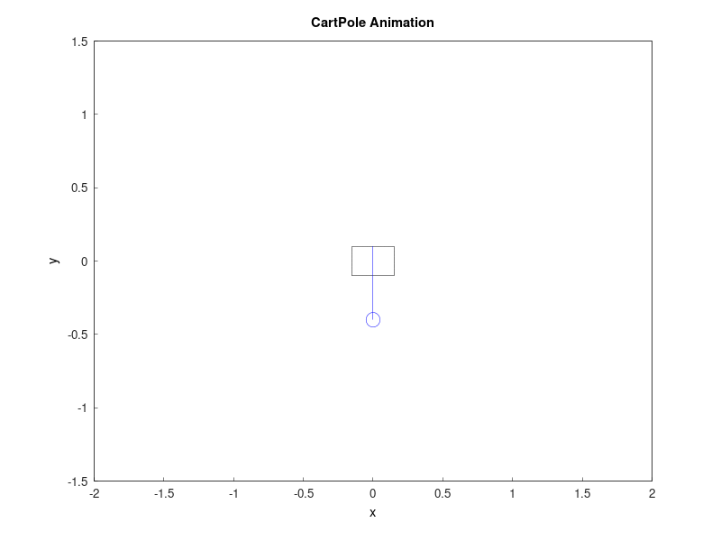

# Constrained Differential Dynamic Programming (CDDP) solver in C++


**This library is under active development.**  Star the repo :star: to stay updated on its progress and eventual release. I welcome any suggestions as I'm building this library to gain practical C++ experience.

## Overview
This is an optimal control solver library using constrained differential dynamic programming (CDDP) written in C++. This library is particularly useful for mobile robot trajectory optimization and model predictive control (MPC).

The CDDP library solves problems in the form:

$$
\min_{\mathbf{U}} J(\mathbf{x}_0, \mathbf{U}) = \phi(\mathbf{x}_N) + \sum \ell(\mathbf{x}_k,\mathbf{u}_k)
$$

$$
\mathrm{s.t.~}  \mathbf{x}_{k+1} = \mathbf{f}(\mathbf{x}_k,\mathbf{u}_k) 
$$

$$
\quad \mathbf{g}(\mathbf{x}_k,\mathbf{u})_k\leq 0
$$

$$
\quad {\mathbf{x}}_{0} = \mathbf{x}{(t_0)} 
$$

$$
\quad k = 0,1,\cdots N-1
$$

## Examples
### Unicycle

Simple car-like robot with velocity and steering control:

```bash
./examples/cddp_unicycle // after building
```


### Unicycle with Obstacle Avoidance

Simple car-like robot with velocity and steering control:

```bash
./examples/cddp_unicycle_safe // after building
```


### Unicycle with Obstacle Avoidance (infeasible initial guess)

```bash
./examples/cddp_unicycle_safe_ipddp // after building
```


### Bicycle Model

Bicycle model with velocity and steering control:

```bash
./examples/cddp_bicycle // after building
```


### Control-limited Car

Car model with limited velocity and steering control:

```bash
./examples/cddp_car // after building
```


```bash
./examples/cddp_car_ipddp // after building
```


### Pendulum

Simple pendulum with torque control:

```bash
./examples/cddp_pendulum // after building
```


### Cartpole

Cartpole with cart control:

```bash
./examples/cddp_cartpole // after building
```




### Quadrotor

Quadrotor with thrust control:

```bash
./examples/cddp_quadrotor_point // after building
```


```bash
./examples/cddp_quadrotor_circle // after building
```


```bash
./examples/cddp_quadrotor_figure_eight_horizontal // after building
```


```bash
./examples/cddp_quadrotor_figure_eight_vertical // after building
```


### Manipulator

Manipulator with joint torque control:

```bash
./examples/cddp_manipulator // after building
```


## Installation
### Dependencies
* [CMake](https://cmake.org/) (Build System)
```bash
sudo apt-get install cmake # For Ubuntu
brew install cmake # For macOS
```

* [Eigen](https://formulae.brew.sh/formula/eigen) (Linear Algebra Library in CPP)
```bash
sudo apt-get install libeigen3-dev # For Ubuntu
brew install eigen # For macOS
```

* [gnuplot](http://www.gnuplot.info/) (Plotting Library)
```bash
sudo apt-get install gnuplot # For Ubuntu
brew install gnuplot # For macOS
```
* [imagemagick](https://imagemagick.org/) (Image Processing Library)
```bash
sudo apt-get install imagemagick # For Ubuntu
brew install imagemagick # For macOS
```


### Building
```bash
git clone -b v0.3.2 https://github.com/astomodynamics/cddp-cpp
cd cddp-cpp
mkdir build && cd build
cmake ..
make -j4
make test
```

## ROS 
If you want to use this library for ROS2 MPC node, please refer [CDDP MPC Package](https://github.com/astomodynamics/cddp_mpc). You do not need to install this library to use the package. MPC package will automatically install this library as a dependency.

## References
* Z. Xie, C. K. Liu and K. Hauser, "Differential dynamic programming with nonlinear constraints," 2017 IEEE International Conference on Robotics and Automation (ICRA), 2017, pp. 695-702, doi: <10.1109/ICRA.2017.7989086>.
* Y. Tassa, N. Mansard and E. Todorov, "Control-limited differential dynamic programming," 2014 IEEE International Conference on Robotics and Automation (ICRA), 2014, pp. 1168-1175, doi: <10.1109/ICRA.2014.6907001>.
* Pavlov, A., Shames, I., and Manzie, C., “Interior Point Differential Dynamic Programming,” IEEE Transactions on Control Systems Technology, Vol. 29, No. 6, 2021, pp. 2720–2727.
* Zhamming Xie's GitHub repository: <https://github.com/ZhaomingXie/CDDP>
* Yuval Tassa's iLQG/DDP trajectory optimization: <https://www.mathworks.com/matlabcentral/fileexchange/52069-ilqg-ddp-trajectory-optimization>
* Andrei Pavlov's GitHub repository: <https://github.com/xapavlov/ipddp>

## Third Party Libraries

This library uses the following open-source libraries as core dependencies:

* [OSQP](https://osqp.org/) (Apache License 2.0)
* [osqp-cpp](https://github.com/google/osqp-cpp) (Apache License 2.0)
* [matplotplusplus](https://github.com/alandefreitas/matplotplusplus) (MIT License)
* [libtorch](https://github.com/pytorch/pytorch) (BSD 3-Clause License)
* [autodiff](https://github.com/autodiff/autodiff) (MIT License)

This library also uses the following open-source libraries for optional features:

* [Ipopt](https://github.com/coin-or/Ipopt) (EPL License)
* [CasADi](https://web.casadi.org/) (GPL License)
* [Acado](https://www.acado.org/) (GPL License)
* [Gurobi](https://www.gurobi.com/) (GPL License)
* [SNOPT](https://ccom.ucsd.edu/~optimizers/) (GPL License)


## Citing
If you use this work in an academic context, please cite this repository.

## License
This project is licensed under the Apache License 2.0 - see the [LICENSE](LICENSE) file for details.

## Collaboration
Contributions to this CDDP solver library are welcome! Whether you're interested in fixing bugs, adding new features, improving documentation, or suggesting new example applications, your input is valuable.

If you'd like to contribute:
1.  **Fork the repository.**
2.  **Create a new branch** for your feature or bug fix: `git checkout -b feature/your-feature-name` or `git checkout -b fix/your-bug-fix`.
3.  **Make your changes** and ensure they are well-tested.
4.  **Commit your changes:** `git commit -m 'Add some amazing feature'`.
5.  **Push to the branch:** `git push origin feature/your-feature-name`.
6.  **Open a Pull Request** against the `main` (or `master`) branch.

If you have ideas for collaboration, want to discuss potential research applications, or have any questions, please feel free to open an issue on GitHub or reach out to the @astomodynamics. We are particularly interested in exploring its use in novel robotic systems and complex motion planning scenarios.

## TODO
* add **python binding**
* improve parallelization
* add simulation and its plots
  * Quadruped robot
  * Manipulator
  * Humanoid
